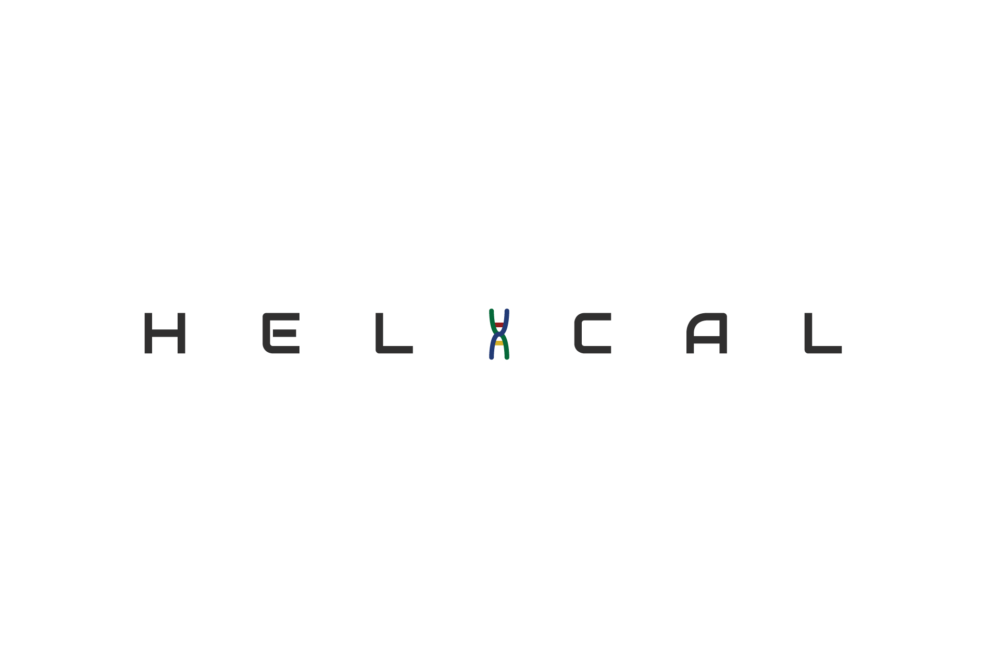

<h1 align="center">The HELiCAL Project</h1>
---

    
    
    
    
    
    

---

## Description

The **HELiCAL** project is a _bioinformatics-based utility_ - designed for front-end and command-line usage - for biologists and technologists alike. 

The intent of the project is to provide basic, intermediate, and advanced _algorithmic operations for genomic data processing_ in an optimized and user-friendly manner. 

Through optimized algorithms design, modular programmatic complexity, and accessible code architectures, I aim to produce a _full-stack Python application_ that's open-source and serves an interesting and modern problem space. 

---

## Dependencies

* [PEP8](http://pep8.readthedocs.io/en/release-1.7.x/)
* [Flask](https://github.com/pallets/flask)

---

## License

The content of this project itself and the source code used to format and display that content are both licensed under the MIT license.

---

## Credits

**HELiCAL** is created and maintained by _Aakash "Kash" Sudhakar_ (2019). 
